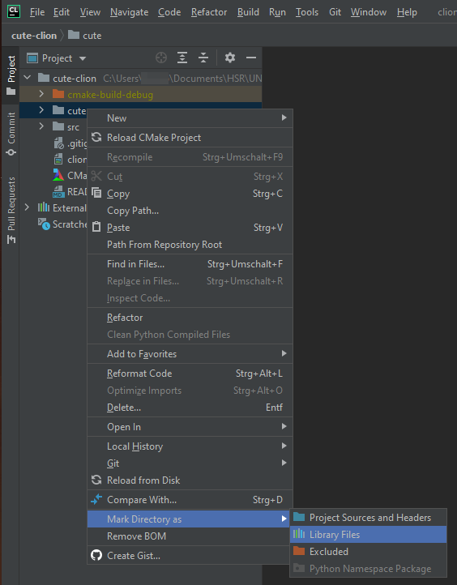

# CUTE Library on CLion
CUTE is an easy to use C++ unit testing framework that leverages modern C++ libraries and features. 
CLion is a cross-platform IDE for C and C++ made by JetBrains.
CUTE has, currently, an Eclipse plugin that is easy to install and use. 
This simple project aims to help beginners run CUTE tests in CLion.


You can either clone this repository (using `git clone`) or copy the structure represented below.
Be sure to check the [.gitignore](.gitignore) file in order to keep unwanted (and possibly conflituous) files from being pushed to a Git repository.


The following tutorial was made and test with the following software:
* CLion 2020.3.2 (Build 203.7148.70)
* CUTE Standalone v2.2.6 (14 Oct 2019)

If something goes wrong or is hard to understand, be sure to contact us at [ni@aefeup.pt](mailto:ni@aefeup.pt), message us on [Facebook](www.facebook.com/niaefeup) or submit a pull request here!

## Table of Contents
1. [Requirements](#requirements)
2. [Structure](#structure)
3. [Adding CUTE to the Project](#adding-cute-to-the-project)
3. [Useful Information](#useful-information)
4. [Understanding CMakeLists.txt](#understanding-cmakeliststxt)

## Requirements

For this to work, we need to install the following programs:
* [CLion](https://www.jetbrains.com/clion/)
* [CUTE Standalone](https://cute-test.com/installation/), which has a link to the [CUTE-Repo on GitHub](https://github.com/PeterSommerlad/CUTE)


## Structure

This step is not needed if you cloned the repository. Otherwise, you need to create the following structure:

```
cute-clion          
|-- CMakeLists.txt  # compilation instructions
`-- src             # source code directory/folder
    `-- Test.cpp     
```


## Adding CUTE to the Project

Now, from the downloaded CUTE Standalone, copy the `cute` folder (that includes `cute-h` and other `cute_..` files) to the project alongside the `src/` folder.
The structure should look like this afterwards:

```
cute-clion
|-- CMakeLists.txt
|-- cute    # added folder from CUTE-master download
|   |-- cute.h 
|   |-- ... (omitted files)
`-- src
    `-- Test.cpp
```

After having achieved the structure above, we need to tell CLion to use `cute_lib` to add CUTE functions to its suggestions system.
To do that, on 'Project' file explorer, right-click the cute_lib folder and mark the directory as 'Library Files', as seen below.



#### Now, everything should work as intended!


## Useful Information

* More folders can be created inside the `src` directory since they are all included automatically.
* The `Test.cpp` file can be deleted and changed, it is just an example. However, it is mandatory that there is a `.cpp` file with a `main` function.


## Understanding CMakeLists.txt

CLion uses CMake to compile its programs. As you can probably guess, `CMakeLists.txt` is the file that tells CMake how to compile the source code.
Let's take a closer look.

```
1  cmake_minimum_required(VERSION 3.8)      
2  project(clion)                          
3  include_directories(cute_lib)          
4  file(GLOB_RECURSE SOURCE_FILES "src/*.cpp")
5  add_executable(clion ${SOURCE_FILES})     
```

Explanation:
1. This instruction specifies the minimum version of CMake required;
2. The `project` command names the project (to be used later);
3. This line includes the CUTE library in the compilation process, allowing us to use its functionality;
4. The `file` instruction will get all filenames that match the `src/*.cpp` pattern and join them all in the `SOURCE_FILES` variable;
5. This function creates the executable from the project name provided in the second line and all the files in the `SOURCE_FILES` variable.
